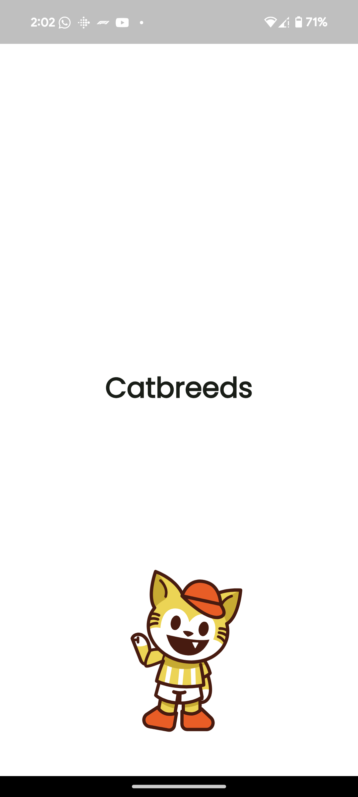
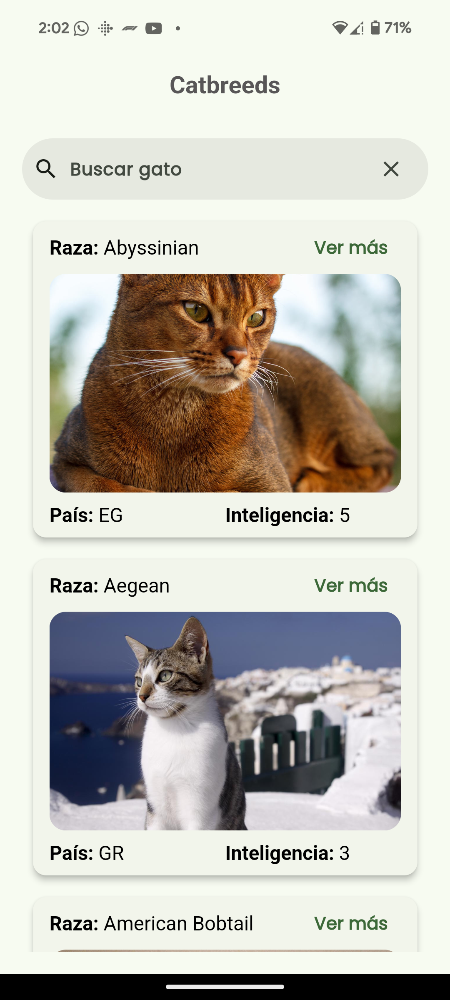
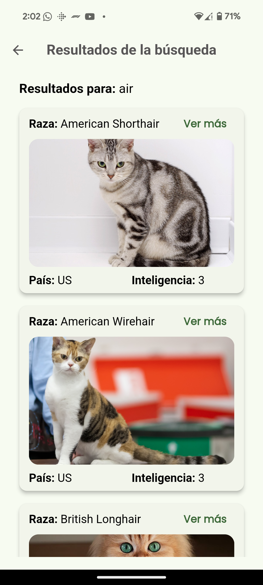
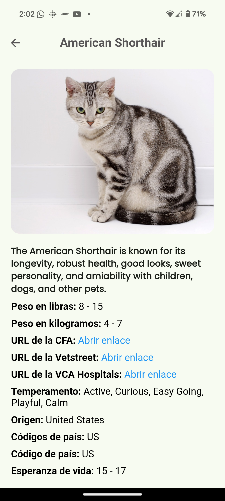

# Catbreeds

[![style: very good analysis][very_good_analysis_badge]][very_good_analysis_link]
[![License: MIT][license_badge]][license_link]

De acuerdo a la necesidad de la vacante, se requiere desarrollar una app en el sistema operativo solicitado (iOS, Android o Ambos) en la herramienta requerida (Android Studio, XCode, Visual Studio, Visual Code, Idea JetBrains) con el framework necesario (Nativo, Flutter, Reactive Native, Ionic, otros).

---

## Getting Started 🚀

Este proyecto contiene 1 flavor:

- production

Para ejecutar el flavor deseado, use la configuración de lanzamiento en VSCode/Android Studio o use los siguientes comandos:

```sh
# Production
$ flutter run --flavor production --target lib/main.dart
```

_\*Catbreeds funciona en iOS y Android._

---

## Funcionalidades 📋

- Splash Screen
- Lista de razas de gatos (Paginada)
- Detalle de raza de gato
- Enlace a las páginas de CFA, Vetstreet, VCA Hospitals y Wikipedia
- Buscador de razas de gatos

---

## Arquitectura 🏛️

La arquitectura utilizada en este proyecto es **Clean Architecture**.

---

## Patrones de diseño 🎨

Los patrones de diseño utilizados en este proyecto son:

- **BLoC** (Business Logic Component)
- **Repository**

---

## Dependencias 📦

Las dependencias utilizadas en este proyecto son:

- **[dio](https://pub.dev/packages/dio)**
- **[equatable](https://pub.dev/packages/equatable)**
- **[flutter_bloc](https://pub.dev/packages/flutter_bloc)**
- **[json_annotation](https://pub.dev/packages/json_annotation)**
- **[json_serializable](https://pub.dev/packages/json_serializable)**
- **[url_launcher](https://pub.dev/packages/url_launcher)**

---

## Estructura de carpetas 📁

La estructura de carpetas utilizada en este proyecto es:

```
lib
├── app
│   ├── cubit
│   ├── |── app_cubit.dart
│   ├── |── app_state.dart
│   ├── misc
│   ├── |── misc.dart
│   ├── |── themes.dart
│   ├── routes
│   ├── |── routes.dart
│   ├── view
│   ├── |── app_page.dart
├── |── |── app_view.dart
├── |── |── view.dart
├── |── app.dart
├── details
│   ├── cubit
│   ├── |── details_cubit.dart
│   ├── |── details_state.dart
│   ├── view
│   ├── |── details_page.dart
├── |── |── details_view.dart
├── |── |── view.dart
├── |── details.dart
├── home
│   ├── cubit
│   ├── |── home_cubit.dart
│   ├── |── home_state.dart
│   ├── view
│   ├── |── home_page.dart
├── |── |── home_view.dart
├── |── |── view.dart
├── |── home.dart
├── l10n
│   ├── arb
│   ├── |── app_en.arb
│   ├── |── app_es.arb
│   ├── l10n.dart
├── search
│   ├── cubit
│   ├── |── search_cubit.dart
│   ├── |── search_state.dart
│   ├── view
│   ├── |── search_page.dart
├── |── |── search_view.dart
├── |── |── view.dart
├── |── search.dart
├── splash
│   ├── cubit
│   ├── |── splash_cubit.dart
│   ├── |── splash_state.dart
│   ├── view
│   ├── |── splash_page.dart
├── |── |── splash_view.dart
├── |── |── view.dart
├── |── splash.dart
├── main.dart
packages
|── user_api
|   ├── lib
|   ├── |── src
|   ├── |── |── models
|   ├── |── |── |── cat.dart
|   ├── |── |── |── cat.g.dart
|   ├── |── |── |── models.dart
|   ├── |── |── |── weight.dart
|   ├── |── |── |── weight.g.dart
|   ├── |── |── user_api.dart
|   ├── |── user_api.dart
|── user_api_remote
|   ├── lib
|   ├── |── src
|   ├── |── |── user_api_remote.dart
|   ├── |── user_api_remote.dart
|── user_repository
|   ├── lib
|   ├── |── src
|   ├── |── |── user_repository.dart
|   ├── |── user_repository.dart
```

---

## Capturas de pantalla 📸

A continuación, se muestran algunas capturas de pantalla de la app:

### Splash Screen



### Home



### Search



### Details



## Demo 🎥

A continuación, se muestra un GIF demostrativo de la app:


